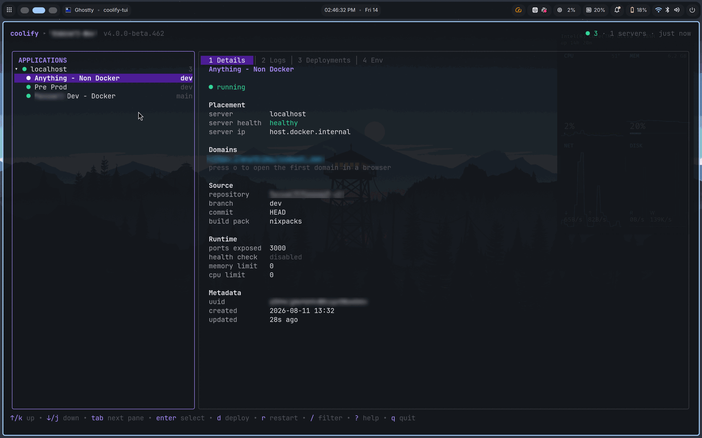
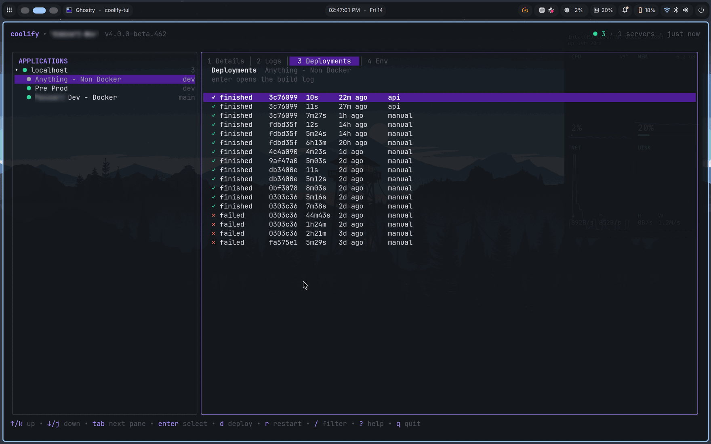
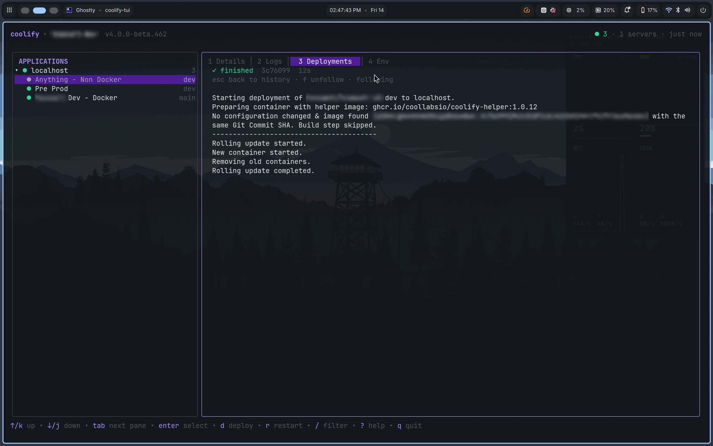
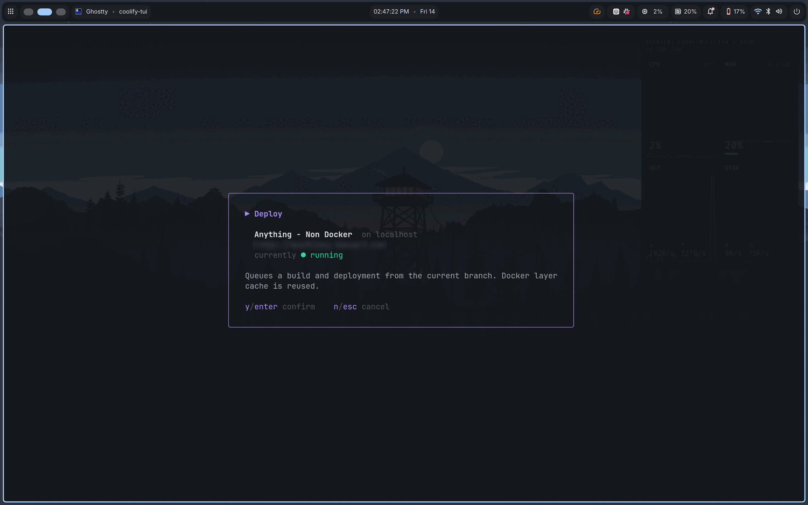
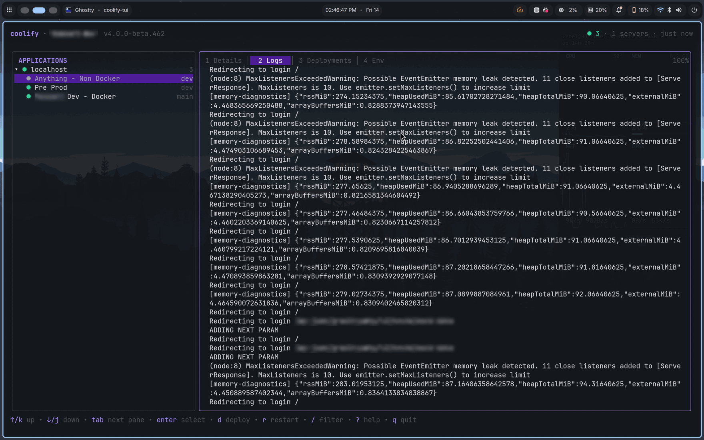
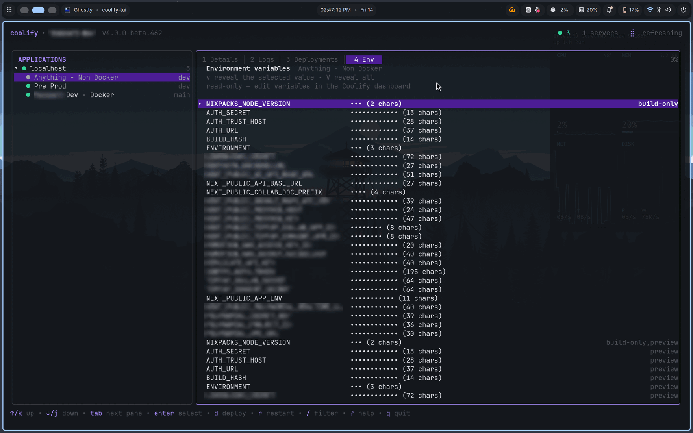

# coolify-tui

A terminal dashboard for [Coolify](https://coolify.io) — monitor your applications
across every server, check their status, trigger deployments and watch them run,
without leaving the terminal. Think `lazydocker`, for Coolify.

```
╭──────────────────────────────────╮╭─────────────────────────────────────────────────╮
│ APPLICATIONS                     ││ 1 Details │ 2 Logs │  3 Deployments  │ 4 Env    │
│▾ ● prod-eu-1              1○ 1◍ 3││  ▶ building  9f2c1ab  1m00s                     │
│   ◍ api-gateway              main││  esc back to history · f unfollow · following   │
│   ● storefront               main││                                                 │
│   ○ worker-emails            main││  $ docker build -f Dockerfile -t store:9f2c1ab . │
│▾ ● prod-us-1                    2││  #5 [2/6] RUN npm ci                            │
│   ● analytics-ingest             ││  added 412 packages in 18s                      │
│   ▶ docs-site          production││  npm warn deprecated inflight@1.0.6              │
│▾ ✕ homelab                      0││  #9 exporting layers done                       │
╰──────────────────────────────────╯╰─────────────────────────────────────────────────╯
```

## Why

Coolify's web dashboard is good, but if you live in a terminal, checking whether
`api` is healthy on `prod-2` shouldn't need a browser tab. `coolify-tui` gives
you one keyboard-driven view over every server and application a Coolify
instance manages.

## Features

- **Multi-instance** — flip between separate Coolify installs (prod, homelab, …)
- **Server-grouped inventory** — applications listed under the server they run on
- **Status at a glance** — `running:healthy`, degraded and stopped, colour-coded
- **Deploy** — trigger a deployment, or a force rebuild without the layer cache
- **Lifecycle** — start, stop and restart applications, with confirmation
- **Deployment history and live build logs** — follow a running build
- **Live container logs** — tail a running application
- **Environment variables** — read-only, masked by default
- **Server health** — reachability, usability and proxy state

## Screenshots

Every application on every server, with the detail pane on the selected one —
placement, source, runtime and metadata:



Deployment history: status, commit, duration, age and what triggered each build.



`enter` on any of them opens its build log. Press `d` and you land here
automatically, following the deployment you just started:



Actions confirm first, and the prompt says what will actually happen:



Container logs, hard-wrapped so column-aligned output keeps its alignment:



Environment variables are masked by default — you get the name, a dot mask and
the value's length, which is enough to spot an empty or truncated value without
putting a secret on screen:



> Screenshots are from a live instance, with instance and application
> identifiers blurred.

## Install

Requires Go 1.24 or newer.

```sh
go install github.com/itsnitinr/coolify-tui@latest
```

Or build from source:

```sh
git clone https://github.com/itsnitinr/coolify-tui
cd coolify-tui
go build -o coolify-tui .
```

## Getting a Coolify API token

1. In Coolify, go to **Security → API Tokens**
2. Give the token a name and an expiry
3. Select these permissions:

   | Permission       | Needed for                                   |
   | ---------------- | -------------------------------------------- |
   | `read`           | listing servers, applications, deployments   |
   | `read:sensitive` | container logs and environment variables     |
   | `write`          | start / stop / restart                       |
   | `deploy`         | triggering deployments                       |

   `read` alone is enough for a read-only monitoring setup.

4. Copy the token — Coolify shows it exactly once. It looks like `42|abc123…`.

Also note your instance URL, e.g. `https://coolify.example.com` (a bare host or
an IP with a port both work).

## First run

Just run it:

```sh
coolify-tui
```

With no config file, `coolify-tui` opens a setup wizard that asks for the
instance name, URL and API token, then verifies them before saving. Verification
reports which token permissions it found, so a token created without
`read:sensitive` is caught immediately rather than at the first log tail.

The token field is masked as you type and never rendered in plaintext.

Add more instances later with `coolify-tui login`, and remove one with
`coolify-tui logout NAME`.

## Configuration

The config file lives at:

```
${XDG_CONFIG_HOME:-~/.config}/coolify-tui/config.yaml
```

It is created with mode `0600` inside a `0700` directory. Print the path with
`coolify-tui -config`.

```yaml
active_instance: prod
refresh_interval: 10s
log_lines: 500
confirm_destructive: true

instances:
  - name: prod
    url: https://coolify.example.com
    token: "42|your-token-here"

  - name: homelab
    url: http://192.168.1.10:8000
    # Keep the token out of the file: read it from the environment instead.
    token_env: HOMELAB_COOLIFY_TOKEN
    # For an instance behind a self-signed certificate:
    insecure_skip_verify: true
```

### Keeping tokens out of the file

Set `token_env` to the name of an environment variable instead of writing
`token`. This is the recommended setup on a shared machine or when your dotfiles
are in git:

```sh
export HOMELAB_COOLIFY_TOKEN="42|your-token-here"
```

`token_env` takes precedence over an inline `token` if both are present.

## Usage

```sh
coolify-tui                    # launch the dashboard
coolify-tui -instance homelab  # open a specific instance
coolify-tui doctor             # check every instance is reachable and authorised
coolify-tui instances          # list configured instances (no tokens shown)
coolify-tui -config            # print the config file path
coolify-tui -version
```

`doctor` is the first thing to run after setup. It verifies connectivity, prints
the Coolify version, and tells you which permission a token is missing:

```
prod (https://coolify.example.com)
  base URL: https://coolify.example.com/api/v1
  ✓ reachable, Coolify 4.0.0-beta.397
  ✓ read (servers): 3 servers (prod-2=unreachable)
  ✓ read (applications): 12 applications
  ✓ read (deployments): 1 queued/running
```

## Keys

| Key | Action |
| --- | --- |
| `↑`/`k`, `↓`/`j` | move the selection |
| `tab` | switch between sidebar and detail pane |
| `←`/`h`, `→`/`l` | focus sidebar / detail pane |
| `enter` | fold a server, or open an application's detail pane |
| `space` | fold or unfold the server you're on |
| `1`–`4`, `[`/`]` | switch detail tabs |
| `d` | deploy the selected application |
| `D` | deploy with the Docker layer cache disabled |
| `s`, `x`, `r` | start, stop, restart |
| `c` | cancel the running build |
| `enter` (Deployments tab) | open a build log |
| `f` | follow / unfollow a live log |
| `t` | toggle log timestamps |
| `.` | show / hide a build log's debug lines |
| `v` | reveal the selected env var's value |
| `V` | reveal every env var value |
| `/` | filter applications by name, domain or branch |
| `o` | open the selected application's domain in a browser |
| `i` | switch Coolify instance |
| `ctrl+r` | refresh everything on screen |
| `?` | full keybinding reference and refresh warnings |
| `q` | quit |

Status glyphs: `●` running · `◍` degraded (up but failing its health check) ·
`○` stopped · `▶` deploying. Degraded is deliberately distinct from both running
and stopped — it's the state worth acting on.

## Actions

Every action asks for confirmation first, and the prompt says what will actually
happen — a stop prompt tells you the app becomes unreachable, a force-deploy
prompt explains the cache is disabled. Set `confirm_destructive: false` in the
config to skip the prompts.

Actions that cannot succeed are refused locally instead of being sent: starting
an already-running app, stopping a stopped one, or cancelling a build that isn't
running. If Coolify answers `403`, the error names the token permission you're
missing rather than just reporting the status code.

While an action is in flight the application shows `◌` and repeated keypresses
are ignored, so a double-tap can't queue two deployments. Because Coolify
processes lifecycle changes on a queue, the dashboard refreshes immediately and
again a couple of seconds later, when the new status has actually settled.

## Watching a deployment

Press `d` and you land on the build log for the deployment you just started —
following live, polled every two seconds. When the build settles, polling stops
and a toast reports the result.

Press `3` on any application for its deployment history: status, commit,
duration, age and what triggered it (`api`, `webhook`, `manual`, `rollback`,
`no-cache`). `enter` opens a build log; `esc` goes back. If a build is already
running, opening the tab jumps straight to it.

In a log, `f` toggles follow. Scrolling up turns follow off so the incoming
output doesn't yank you back to the tail; `G` returns to the bottom and resumes.
Build steps render as `$ command` so a long log stays skimmable, and stderr is
coloured.

The entries Coolify marks hidden — what its own UI shows only with debug turned
on — are included, dimmed so they don't compete with the build's own output.
Press `.` to hide them for a cleaner log. They're the plumbing around each build
step, so they can carry environment values that the rest of the dashboard keeps
masked.

## Logs and environment variables

`2` tails a running application's container logs, polled every three seconds and
followed by default. `t` toggles timestamps. Output is hard-wrapped rather than
re-flowed, so column-aligned log lines keep their alignment. Polling stops the
moment you leave the tab.

`4` lists environment variables, **masked by default** — you see the name, a dot
mask and the value's length, which is enough to spot an empty or truncated
value without putting a secret on screen. `v` reveals just the selected one; `V`
reveals all and shows a warning while it's on, because that's the risky mode.
Reveals never carry over when you move to another application. Values are
read-only here; edit them in Coolify.

Both tabs need the `read:sensitive` token permission. Without it they say so and
name the permission — the rest of the dashboard keeps working.

## Security

- The config file is written `0600` in a `0700` directory, atomically.
- `coolify-tui` warns at startup if the config file is more permissive than
  `0600`.
- Tokens are never written to logs or error messages; anything displayed goes
  through redaction that masks the secret half of the token.
- Environment variable values are masked in the UI until explicitly revealed.
- `.gitignore` excludes `config.yaml` and `.env*` so a stray copy inside a clone
  cannot be committed.
- `insecure_skip_verify` is opt-in per instance and disables TLS verification —
  only use it for a self-signed homelab instance.
- On Windows the mode check is skipped, because NTFS uses ACLs and `os.Chmod`
  only toggles the read-only attribute — every file reports `0666` regardless of
  who can read it. The config still lands under `%LocalAppData%`, whose default
  ACL is scoped to your user account.

## Roadmap

- [x] **Phase 1** — API client, config, `doctor`
- [x] **Phase 2** — onboarding wizard
- [x] **Phase 3** — dashboard shell
- [x] **Phase 4** — deploy and lifecycle actions
- [x] **Phase 5** — deployment history and live build logs
- [x] **Phase 6** — container logs, environment variables, server health
- [x] **Phase 7** — instance switcher, release tooling, docs

## Multiple instances

Press `i` to switch between configured instances. Switching discards everything
on screen — inventory, tabs, revealed env values — because it all described a
different Coolify install, and saves your choice as the new default. If an
instance's token comes from `token_env` and that variable isn't exported, the
switch fails cleanly and names the variable.

## Development

```sh
make check      # vet, gofmt check and the full test suite
make test-race  # the TUI is concurrent; this is what CI runs
make build      # ./coolify-tui with version stamped in
make help       # list targets
```

The Coolify client is tested against `httptest` servers replaying recorded
response shapes, so the suite needs no live instance and no credentials.

Notable invariants the tests enforce:

- **The view is exactly the terminal's size.** Every screen — dashboard, modals,
  each tab — is asserted to be exactly `height` lines with no line wider than
  `width`, at several sizes. Overflow makes the terminal scroll and tears the
  layout.
- **Secrets never render.** Tests assert the API token never appears in the
  onboarding wizard's output or in any error message, and that env var values
  stay masked until explicitly revealed.
- **Styled text is never sliced.** Only plain text is truncated; full lines are
  clamped with an ANSI-aware helper. Cutting mid-escape-sequence corrupts the
  rest of the screen.

### Layout

```
main.go                 CLI: launch, login, logout, doctor, instances
internal/config         multi-instance YAML config, 0600, token_env indirection
internal/coolify        typed Coolify v1 API client and inventory join
internal/ui             theme, onboarding wizard, dashboard and its tabs
```

## Credits

Built with [Bubble Tea](https://github.com/charmbracelet/bubbletea),
[Bubbles](https://github.com/charmbracelet/bubbles) and
[Lipgloss](https://github.com/charmbracelet/lipgloss).

Not affiliated with the Coolify project.

## License

[MIT](LICENSE)
